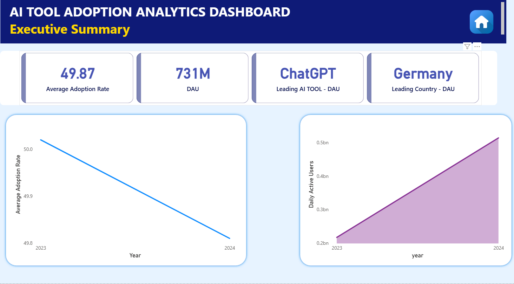
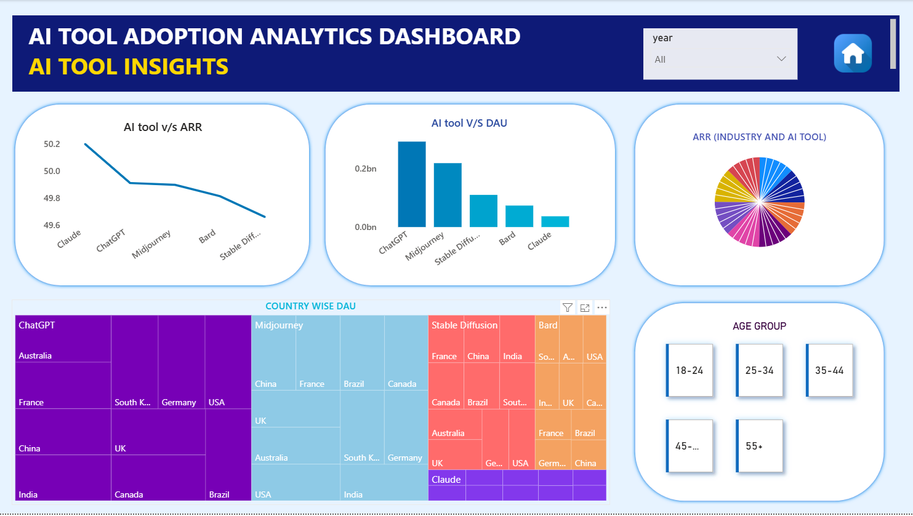
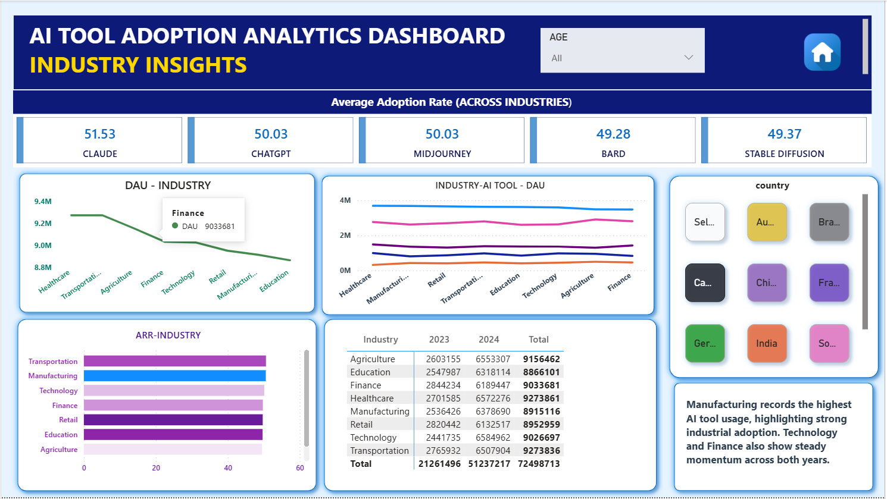
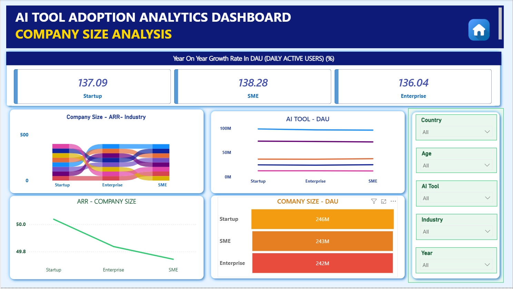
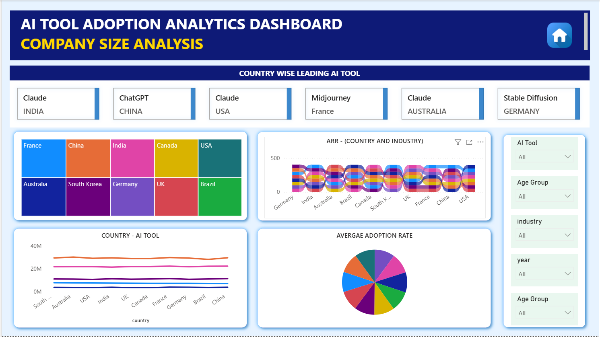
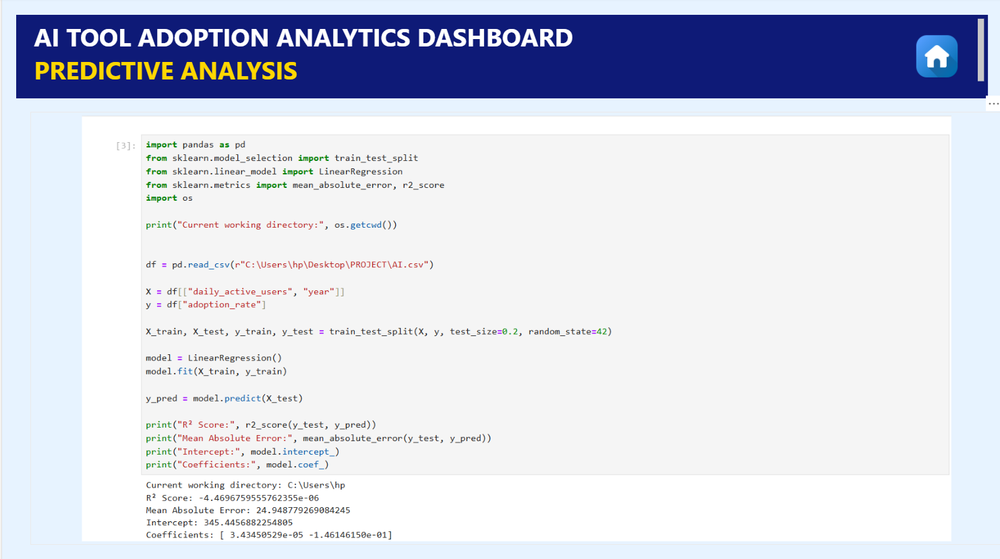

# AI Tool Adoption Analytics Dashboard

An interactive **Power BI** dashboard analysing how AI tools (ChatGPT, Claude, Midjourney, Bard, Stable Diffusion) are adopted across **countries, industries, company sizes and age groups**, backed by SQL-driven KPIs and a Python regression baseline.


## Problem Statement
Business analysts and decision-makers need a single place to see which AI tools lead in usage, where adoption is growing, and how it differs by industry, company size and region. This project turns [50K+] raw adoption records into a self-serve dashboard for those questions.

## Key Features
- **6 navigable report pages** with a home page navigation pane
- **15+ DAX measures** for adoption rate, DAU and year-on-year growth
- **20+ visuals**: KPI cards, line, area, bar, treemap, pie, ribbon and matrix charts
- **Slicers** for year, age group, country, industry, AI tool and company size
- **Python predictive analysis** using Linear Regression (scikit-learn)

## Tech Stack
| Area | Tools |
|---|---|
| Visualisation & modelling | Power BI, DAX |
| Data querying | SQL |
| Analysis | Python, Pandas, NumPy, scikit-learn, Jupyter |

## Dataset
[50K+] records covering AI tool, country, industry, company size, age group, daily active users (DAU), adoption rate and year (2023 to 2024). Source: [add the Kaggle or other link here]. Columns include `daily_active_users`, `adoption_rate` and `year`.

## Dashboard Pages

### 1. Executive Summary
Headline KPIs: average adoption rate **49.87**, total DAU **731M**, leading AI tool **ChatGPT**, leading country **Germany**, plus yearly trends for adoption rate and DAU.


### 2. AI Tool Insights
Compares tools by adoption rate (ARR), DAU and country-wise DAU, with an age-group filter.


### 3. Industry Insights
Average adoption rate per tool (Claude highest at **51.53**), DAU by industry and a 2023 vs 2024 industry matrix.


### 4. Company Size Analysis
Year-on-year DAU growth of roughly **136 to 138%** across Startups, SMEs and Enterprises, with tool-level DAU by company size.


### 5. Country-wise Dashboard
Leading AI tool per country and adoption by country and industry.


### 6. Predictive Analysis
A baseline Linear Regression using `daily_active_users` and `year` to predict `adoption_rate` (80/20 train-test split).


## Key Insights
- **ChatGPT** leads in daily active users; **Claude** has the highest average adoption rate (51.53).
- Total DAU grew strongly from 2023 to 2024, while average adoption rate stayed almost flat (about 50.0 to 49.8).
- DAU growth is similar across company sizes (Startup 137.09%, SME 138.28%, Enterprise 136.04%).
- Industry DAU totals are close together, with Healthcare and Transportation at the top (about 9.27M each).
- **Predictive result:** the baseline model returned R² ≈ 0 (MAE ≈ 24.9), meaning DAU and year alone do not explain adoption rate linearly. Next steps would be adding categorical features (tool, industry, country) and trying non-linear models.

## How to Run
1. Clone the repo: `git clone https://github.com/lavprit01/AI-Tool-Adoption-Analytics-Dashboard.git`
2. Open `dashboard/AI_Tool_Adoption_Dashboard.pbix` in **Power BI Desktop** (free, Windows).
3. For the notebook: `pip install pandas scikit-learn jupyter`, then open `notebooks/predictive_analysis.ipynb` (reads `data/AI.csv`).

## Project Structure
```
├── dashboard/     Power BI file
├── data/          Dataset
├── notebooks/     Regression analysis
├── screenshots/   Dashboard page previews
└── docs/          PDF export
```

## Author
**Lavprit Anand** · B.Tech, Production and Industrial Engineering, MNNIT Allahabad
[LinkedIn](https://www.linkedin.com/in/lavprit-anand-13aa38297/) · [GitHub](https://github.com/lavprit01) · lavprit.mnnit@gmail.com
